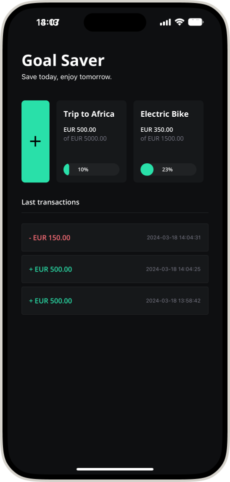
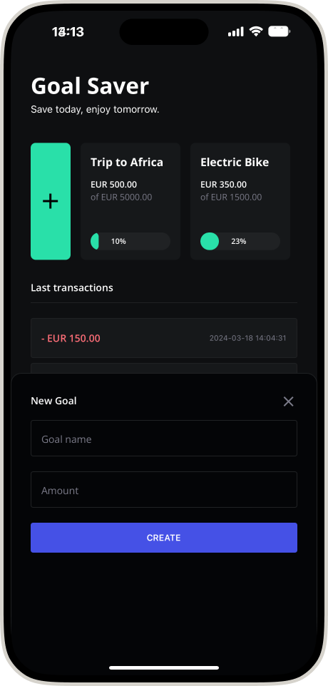
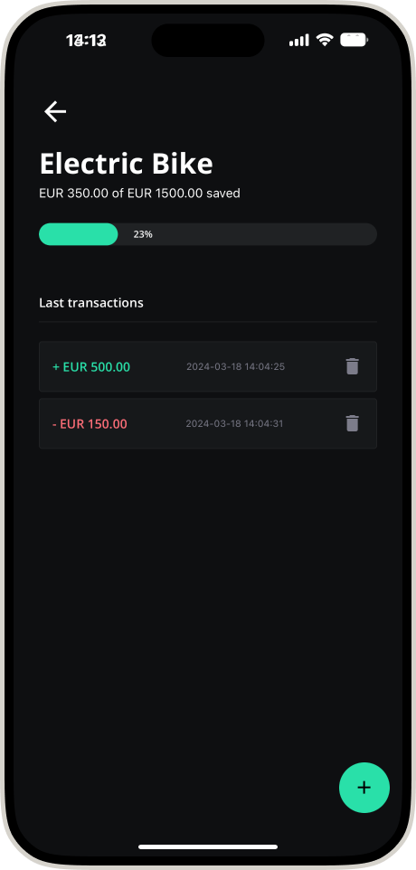
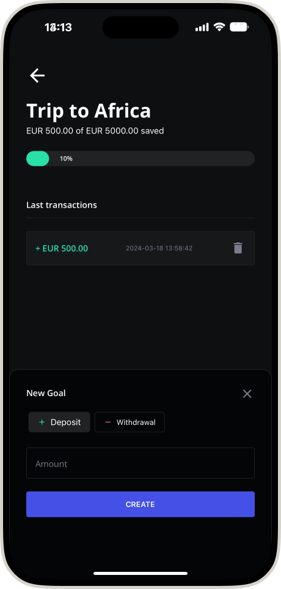

# GoalSaver

## Description

GoalSaver is a mobile app designed to help users set and achieve their financial goals for future purchases or experiences. Users can add their savings goals, track their progress with each deposit, and visualize their journey towards making their dreams a reality. 

This project serves as an experiment to test and showcase new functionalities provided by Expo, React Native, NativeWind, and Expo SQLite. Through the development of GoalSaver, I aim to explore the latest features and best practices within these frameworks and libraries, pushing the boundaries of what's possible in mobile app development. 

## Screenshots

| Home Screen             | Create Goal Screen         |
|-------------------------|-----------------------------|
|    |  |

| Goal Details            | Goal Progress Details       |
|-------------------------|-----------------------------|
|  |  |


## Key Libraries used in GoalSaver

- **@react-navigation/native**: This library provides navigation functionality for React Native apps. It enables the implementation of navigation from one screen to another within the app, supporting both stack navigation and tab navigation, which are essential for a seamless user experience.

- **Day.js**: A minimalist JavaScript library that parses, validates, manipulates, and displays dates and times for modern browsers. In GoalSaver, Day.js is used to handle all date and time-related operations, ensuring that time-sensitive data is accurately processed and presented.

- **@gorhom/bottom-sheet**: This library offers a highly customizable and performant bottom sheet component, enhancing the interactive capabilities of GoalSaver by allowing users to access additional content and controls without leaving their current context.

- **TailwindCSS & NativeWind**: Leveraging the utility-first CSS framework, TailwindCSS, and NativeWind (its React Native implementation), GoalSaver achieves consistent styling and rapid UI development. These tools enable us to build custom designs with speed and efficiency without sacrificing the app's aesthetics or performance.

- **Expo SQLite**: Provides a simple and efficient way to store, access, and manipulate local data in SQLite databases. This is crucial for GoalSaver's data persistence, allowing the app to store user goals, progress, and preferences locally on the device.

These libraries and frameworks form the backbone of the GoalSaver app, each contributing to its functionality, usability, and overall user experience.


## Installation

Provide step by step series of examples and explanations about how to get a development environment running.

```bash
git clone git@github.com:ivanseibel/goal-saver-react-native-experiments.git
cd goal-saver-react-native-experiments
npm install
```

## Usage

Show examples of usage:
```bash
npm start
```

## Contributing

Please read [CONTRIBUTING.md](CONTRIBUTING.md) for details on our code of conduct, and the process for submitting pull requests to us.

## License

This project is licensed under the MIT License - see the [LICENSE.md](LICENSE.md) file for details